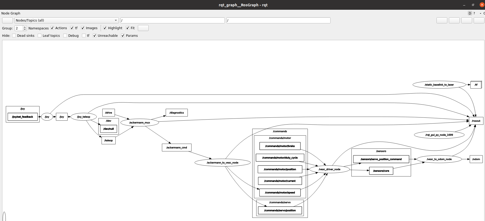

# Docker for developing in Project F1TENTH
## Version 0.1.0

## General
The setup contains a ROS2(/workspace) setup that contains the used repositories in built form.
A terminal window will open with "f1tenth" user in /workspace folder. 
The container uses host networking, means it has not its own ip and network layer, it uses the host machine ip adress and network configuration.
ROS2 discovery server is set, all of the ROS2 nodes in the ROS2 network have to use that.

SSH service of the container uses port 24.

The container builds the system and starts it automatically in case of computers without DISPLAY environment variable.

---
**Warning!**
If the docker image is rebuilt or any changes are made in the docker-compose file, then the 
earilier used container will be delelted with all of the modification within it.

---
### Files:
- `Dockerfile`

    - Based on [nvidia/cuda:12.2.0-base-ubuntu22.04](https://hub.docker.com/r/nvidia/cuda) or [nvcr.io/nvidia/l4t-base:r36.2.0](https://hub.docker.com/r/nvidia/cuda)
    - Contains basic applications.
    - Main working folders are created.

- `docker-compose.yml`

    Contains a F1TENTH_developer_container service, that will create the container.

    If the host PC has nvidia gpu, it is recommended to use nvidia runtime in the docker-compose file.

    Additional files, folders and volumes of the host PC can be added to the container.

    For exmaple:
    ```
    volumes:
        - /tmp/.X11-unix:/tmp/.X11-unix:rw
        - ./entry.sh:/entry.sh

    !!  - source_path:target_path        !!
    ```

- `entry.sh`
Start ssh service.
Configure the discovery server of ROS2 and set the actual ip4 address
Based on the DISPLAY environment variable that is set in the docker-compose.yml, the container opens a terminator window or be in stand-by state(/bin/bash).
Build the system and start it in case of computer without DISPLAY environment variable.
Any additional commands can be added before the "terminator" command, if they are required to run before the opening of the terminal window. 

- `build_client.sh`
Collects the UID, GID and passing to the Dockerfile as calibration and builds the docker image. Calibrate CAN, gpio, wifi and ethernet interfaces interfaces if they are missing.

- `start_client.sh`
Start the container based on the docker compose file.
If the docker image is missing, it will build it and automatically start the container, but highly recommended to use the build_client.sh, that uses additional settings.
If the container's terminal window is closed, the container will stop.

---
## Recommended usage on first time or if modifications were made in the Dockerfile or in the docker-compose.yml
0. Probably need to install/upgrade docker => use `utility/docker_install.sh` and `utility/nvidia_container_install.sh`
1. Build the image with the `./build_client.sh`
2. Set the necessary volumes in the docker-compose.yml
    - Set the nvidia runtime if possible (nvidia GPU is required)
3. Start vscode with pre-installed Docker, Dev Container, Remote Explorer extensions and open the repo folder with it. The vscode will detect the devcontainer.json and start the container based on the `docker-compose.yml`. After that the vscode will attach to the container install the extensions and development can be done

Recommended to wait untill the extensions are installed before the vscode closed again.

## Usage generally
1. Use vscode with the extensions, that will attach to the container and one can continue the work.

---

## Recomended VS Code externsions
- Docker: ms-azuretools.vscode-docker
- Dev Container: ms-vscode-remote.remote-containers
- Remote Explorer: ms-vscode.remote-explorer

- CMake: twxs.cmake
- CMake Language support: josetr.cmake-language-support-vscode
- CMake tools: ms-vscode.cmake-tools
- ROS: ms-iot.vscode-ros
- TODO tree: gruntfuggly.todo-tree

---

## Link collection
Use Yolo on Jetson platforms:
- https://docs.ultralytics.com/guides/nvidia-jetson/

RealSense SDK install for Jetson:
- https://github.com/intelRealSense/librealsense/blob/master/doc/installation_jetson.md

F1Tenth's website:
- https://roboracer.ai/build

## RealSense SDK install for Jetson
1. Register the server's public key:
- sudo apt-key adv --keyserver keyserver.ubuntu.com --recv-key F6E65AC044F831AC80A06380C8B3A55A6F3EFCDE || sudo apt-key adv --keyserver hkp://keyserver.ubuntu.com:80 --recv-key F6E65AC044F831AC80A06380C8B3A55A6F3EFCDE
2. Add the server to the list of repositories:
- sudo add-apt-repository "deb https://librealsense.intel.com/Debian/apt-repo $(lsb_release -cs) main" -u
3. Install the SDK:
- sudo apt-get install librealsense2-utils
- sudo apt-get install librealsense2-dev
4. Run the RealSense SDK:
- realsense-viewer

## Useful commands
- Starting F1 stack: `ros2 launch f1tenth_stack bringup_launch.py`
- Intel RealSense starting camera: `ros2 launch realsense2_camera rs_launch.py`
- Starting Rviz2: `rviz2`
- ROS node topology: `ros2 run rqt_graph rqt_graph`


- ...